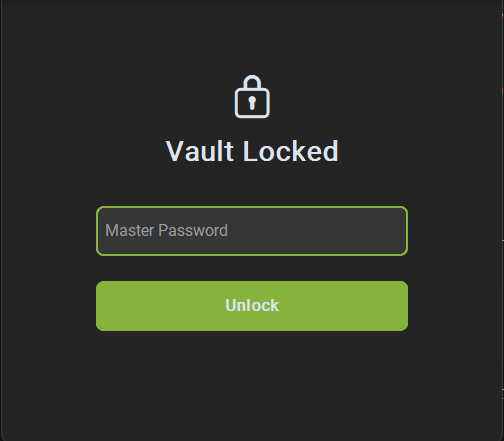
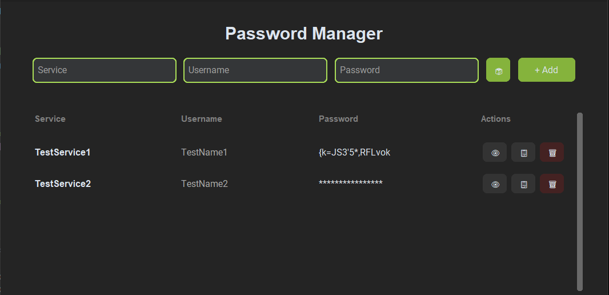

# 🔒 Secure Password Manager

Ein lokal basierter, verschlüsselter Passwort-Manager, entwickelt mit **Python** und **CustomTkinter**.
---

## 📸 Screenshots

| Login & Tresor-Entsperrung | Hauptmenü & Verwaltung |
|:---:|:---:|
|  |  |

---

## 🛡️ Security Features

Der Passwort Manager wurde nicht nur für die Funktionalität, sondern primär für die Sicherheit der Daten entwickelt:

- **Kryptographisch sichere Passwörter:** Der Generator für die Passwörter nutzt das Python-Modul `secrets` (CSPRNG), um echte Entropie zu gewährleisten und Vorhersage-Angriffe zu verhindern.
- **Master-Passwort Schutz:** Zugriff auf den Tresor ist nur über ein Master-Passwort möglich.
- **PBKDF2 Key Derivation:** Das Master-Passwort wird immer verschlüsselt gespeichert. Es wird durch **PBKDF2 (HMAC-SHA256)** und einem persöhnlichen **Salt** ein 256-Bit Schlüssel abgeleitet.
- **AES-256 Verschlüsselung:** Die Passwörter werden lokal durch AES verschlüsselt gespeichert (`passwords.bin`).
- **Shoulder-Surfing Protection:** Alle Passwörter im UI sind standardmäßig maskiert (`*`). Die Sichtbarkeit kann nur durch explizite Benutzerinteraktion kurzzeitig aktiviert werden.

---

## 🚀 Funktionalitäten

- [x] **Vault-System:** Lokale Speicherung verschlüsselter Zugangsdaten.
- [x] **Passwort-Generator:** Erstellung sicherer Passwörter per Würfel-Button.
- [x] **Clipboard-Integration:** Sicheres Kopieren von Passwörtern in die Zwischenablage.
- [x] **Modernes UI:** Dunkles Design optimiert mit der CustomTkinter Library.
- [x] **Sicheres Löschen:** Einträge können jederzeit aus dem verschlüsselten Speicher entfernt werden.

---

## 🛠️ Tech-Stack

- **Sprache:** Python 3.10+
- **GUI:** CustomTkinter (Modern Dark Theme)
- **Kryptographie:** `cryptography.fernet`, `hashlib` (PBKDF2)
- **Zufallswert-Generator:** `secrets` (CSPRNG)

---

## 📂 Projektstruktur

```text
password_manager/
├── main.py                 # Einstiegspunkt & Pfadmanagement
├── core/                   # Logik & Kryptographie
│   ├── generate_password.py # CSPRNG Generator
│   ├── derive_key.py        # PBKDF2 Implementierung
│   ├── encrypt_decrypt.py   # AES Logik (KeySafe)
│   ├── password_entries.py  # Datenklassen
│   └── save_data.py         # Speicher-Logik
├── gui/                    # Benutzeroberfläche
│   └── gui.py              # CustomTkinter Implementierung
└── data/                   # Verschlüsselte Dateien (lokal)
    ├── salt.bin            # Individueller Salt für PBKDF2
    └── passwords.bin       # AES-verschlüsselter Tresor
